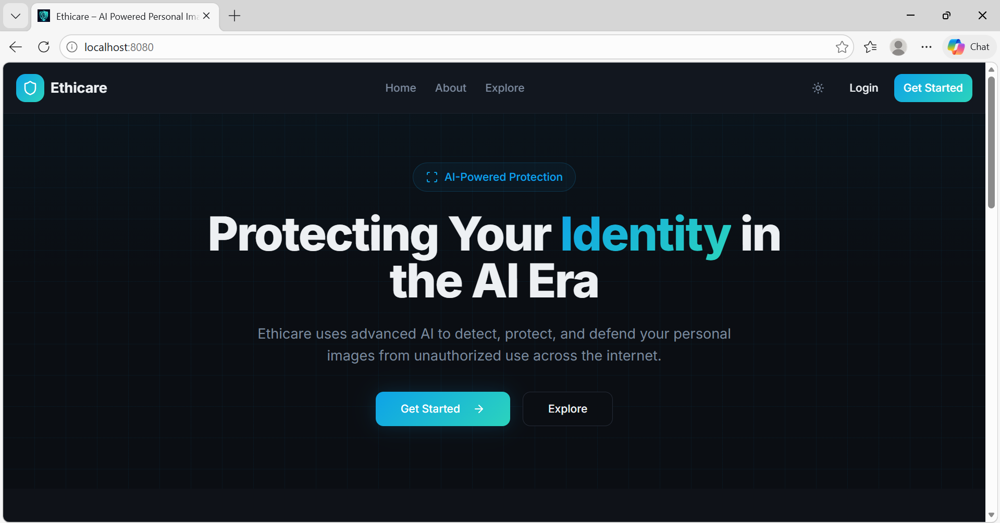
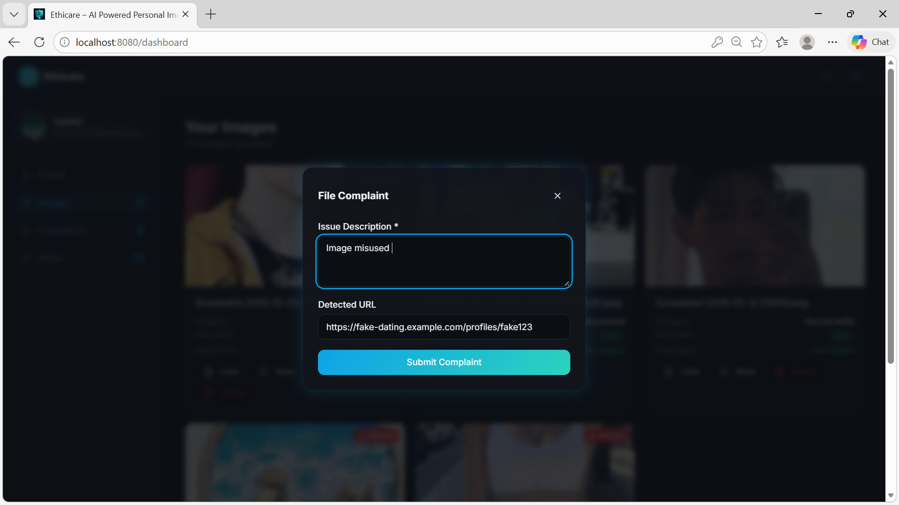
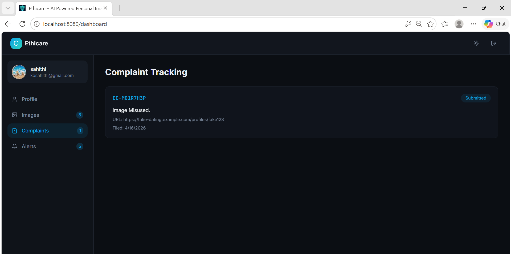
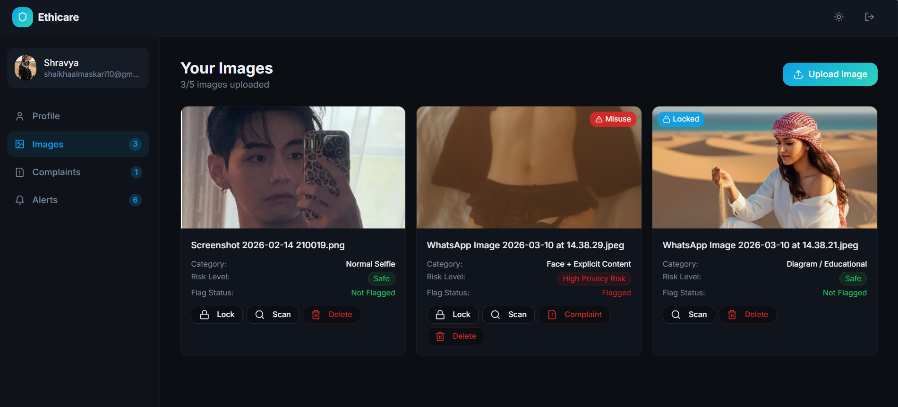
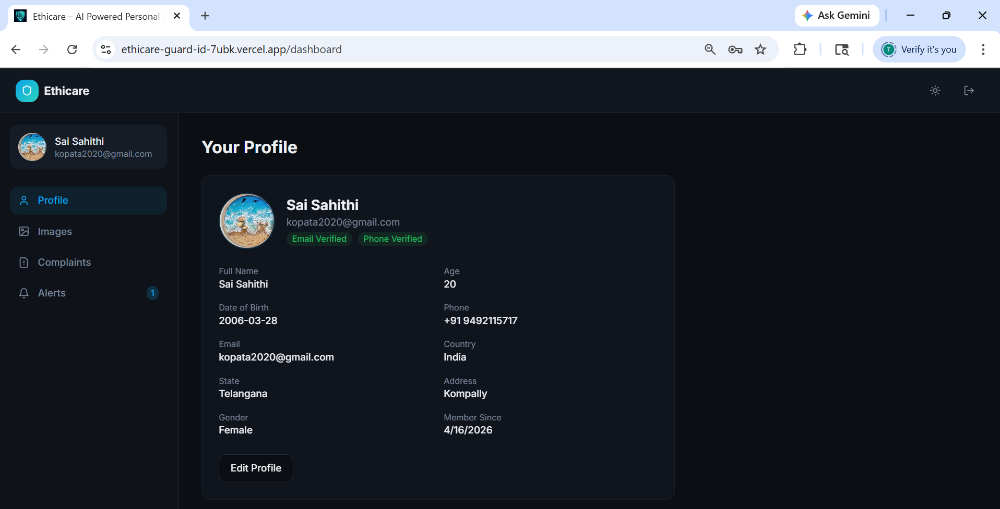

# 🛡️ Ethicare Guard ID

Ethicare Guard ID is an AI-powered image protection and misuse detection platform designed to help users safeguard their personal images from unauthorized access, distribution, and exploitation.

The platform provides secure image locking, AI-based content classification, reverse image search simulation, complaint tracking, and real-time notifications through a modern and user-friendly web interface.

---

## 🚀 Features

### 🔐 User Authentication
- Secure user registration and login
- Email and password authentication using Supabase
- Profile management system

### 🖼️ Image Protection
- Upload personal images securely
- Image locking mechanisms
  - PIN Lock
  - Face Recognition Lock
  - Eye Recognition Lock

### 🤖 AI-Based Image Analysis
- Automatic image classification
- Risk-level detection
- Explicit content identification
- Face detection simulation

### 🔍 Misuse Detection
- Reverse image search simulation
- Detect unauthorized image usage
- Risk assessment and flagging

### 📋 Complaint Management
- File complaints for detected misuses
- Track complaint status
- Complaint history management

### 🔔 Notifications
- Real-time alerts
- Security warnings
- Threat notifications

### 👨‍💼 Admin Dashboard
- User management
- Uploaded image monitoring
- Complaint review system
- Risk analysis dashboard

### 🎨 Modern UI/UX
- Responsive design
- Dark/Light theme support
- Interactive animations using Framer Motion
- Built with Tailwind CSS and ShadCN UI

---

## 🏗️ System Architecture

```text
User
 │
 ▼
Authentication (Supabase)
 │
 ▼
Dashboard
 ├── Profile Management
 ├── Image Upload
 ├── AI Classification
 ├── Image Locking
 ├── Misuse Detection
 ├── Complaint Tracking
 └── Notifications

Admin Panel
 ├── User Monitoring
 ├── Image Monitoring
 └── Complaint Management
```

---

## 🛠️ Tech Stack

### Frontend
- React.js
- TypeScript
- Vite
- Tailwind CSS
- ShadCN UI
- Framer Motion

### Backend & Database
- Supabase
- PostgreSQL (via Supabase)

### State Management
- React Query

### Authentication
- Supabase Auth

### Icons
- Lucide React

---

## 📂 Project Structure

```text
ethicare-guard-id-main/
│
├── public/
├── src/
│   ├── components/
│   ├── contexts/
│   ├── integrations/
│   ├── lib/
│   ├── pages/
│   │   ├── HomePage
│   │   ├── AboutPage
│   │   ├── ExplorePage
│   │   ├── LoginPage
│   │   ├── SignupPage
│   │   ├── DashboardPage
│   │   └── AdminPage
│   │
│   └── App.tsx
│
├── supabase/
├── package.json
└── README.md
```

---

## 📸 Screenshots

### Home Page



### Complaint Management



### Complaint Tracking



### Image Upload



### User Account



---

## ⚙️ Installation

### 1. Clone Repository

```bash
git clone https://github.com/your-username/ethicare-guard-id.git
```

### 2. Navigate to Project

```bash
cd ethicare-guard-id
```

### 3. Install Dependencies

```bash
npm install
```

### 4. Configure Environment Variables

Create a `.env` file:

```env
VITE_SUPABASE_URL=your_supabase_url
VITE_SUPABASE_ANON_KEY=your_supabase_anon_key
```

### 5. Run Development Server

```bash
npm run dev
```

### 6. Build for Production

```bash
npm run build
```

---

## 🔄 Workflow

1. User registers and logs in.
2. User uploads personal images.
3. AI analyzes image content.
4. Risk level is generated.
5. User applies image lock.
6. Reverse image search checks misuse.
7. Alerts are generated if threats are detected.
8. User can file complaints.
9. Admin reviews complaints and updates status.

---

## 🎯 Future Enhancements

- Real AI image classification models
- Facial recognition integration
- OCR-based content analysis
- Automated takedown requests
- Blockchain-based image ownership verification
- Mobile application support
- Real reverse image search integration

---

## 👥 Contributors

- Sai Sahithi
- Project Team Members

---

## 📄 License

This project is developed for educational and research purposes.

---

## 🌟 Project Objective

To provide individuals with a secure platform that leverages AI technologies to protect personal images, detect misuse, and ensure digital privacy in today's internet-driven world.